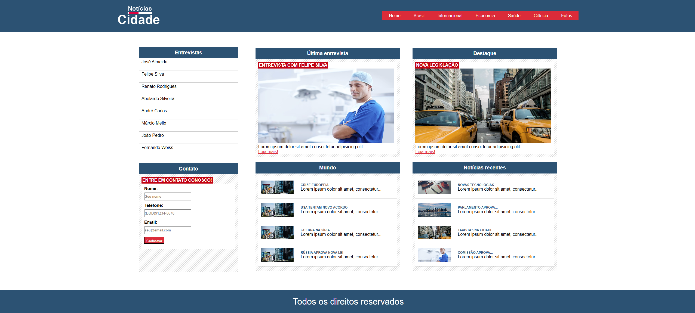

# 📰 News Site

Projeto simples de site de notícias desenvolvido utilizando apenas **HTML5** e **CSS3**, com foco na prática de estruturação de páginas web e estilização.

## 📌 Sobre o Projeto

O **News Site** é um site estático que simula um site de notícias, contendo diferentes categorias como:

O objetivo do projeto foi consolidar conceitos fundamentais de desenvolvimento front-end, como:

- Estruturação semântica com HTML
- Organização de múltiplas páginas
- Estilização com CSS

---

## 🚀 Tecnologias Utilizadas

- HTML5
- CSS3

---

## 📂 Aprendizados

- Estruturação de páginas com HTML
- Criação de layouts utilizando FlexBox e GridLayout
- Boas práticas básicas de front-end
- Design responsivo por meio de media queries